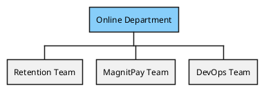
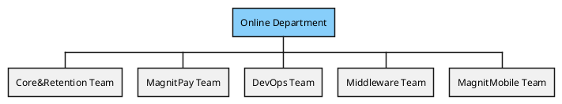
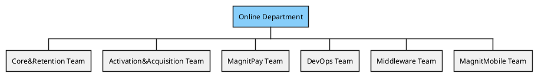
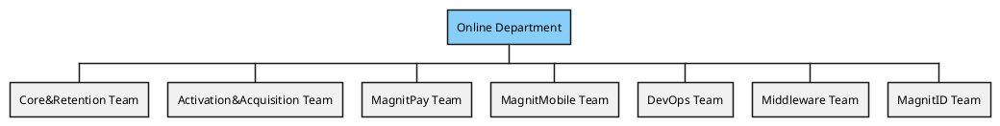
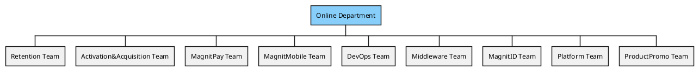
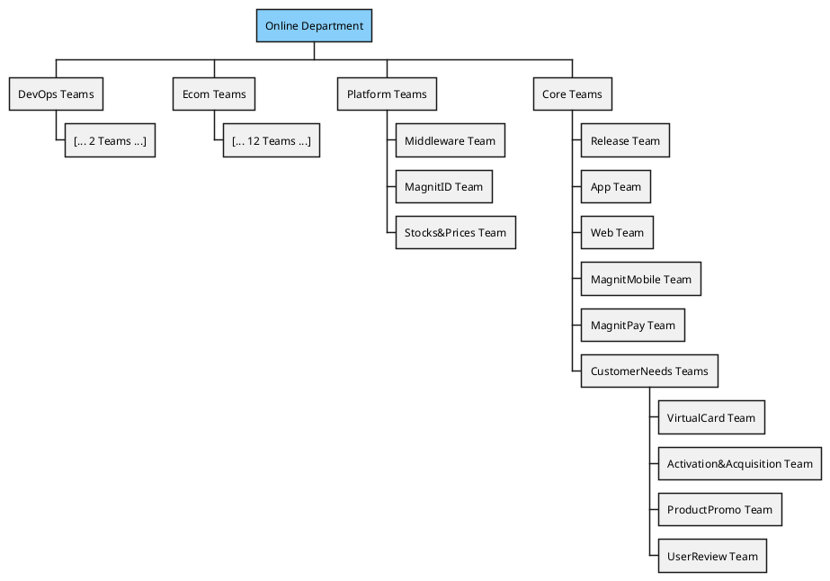

# Org Chart

## История формирования команд

### 2021

История тут

#### q1

#### q2

#### q3

#### q4

### 2022

Планы тут

#### q1

#### q2

## Виды команд и почему они у нас такие

Источники

* книга [TeamTopologies](https://teamtopologies.com/)
* конференция [TechLead](https://www.youtube.com/watch?v=dtSzAjt5YQc)
* конференция [DevopsConf](https://devopsconf.io/moscow/2021/abstracts/7531)
* статья [Организация Agile команд и ARTs: Командная топология в масштабе](https://agilelab.org/blog/organizing-agile-teams-and-arts-team-topologies-at-scale)
* статья [Платформенные команды — что это такое и зачем они нужны](https://apolomodov.medium.com/%D0%BF%D0%BB%D0%B0%D1%82%D1%84%D0%BE%D1%80%D0%BC%D0%B5%D0%BD%D0%BD%D1%8B%D0%B5-%D0%BA%D0%BE%D0%BC%D0%B0%D0%BD%D0%B4%D1%8B-%D1%87%D1%82%D0%BE-%D1%8D%D1%82%D0%BE-%D1%82%D0%B0%D0%BA%D0%BE%D0%B5-%D0%B8-%D0%B7%D0%B0%D1%87%D0%B5%D0%BC-%D0%BE%D0%BD%D0%B8-%D0%BD%D1%83%D0%B6%D0%BD%D1%8B-d4c978115152)

## Platform Teams

Платформенная команда, организована вокруг разработки и поддержки платформ, предоставляющих услуги другим командам.

### Характеристики

* Ориентированность на потребность коллег — если члены платформенной команды не воспринимают свою работу как продукт, который должен облегчить жизнь коллег, то скорее всего платформенная команда ускоренно движется в сторону своего расформирования.
* Высокий уровень технических компетенций — часто сложность задачи по созданию платформы для продуктовых команд сложнее, чем продуктовые задачи, а это значит, что и требования к компетенциям выше.
* Богатый опыт — зачастую только с опытом приходит некоторая технологическая мудрость, когда ты проектируешь общие решения не слишком ограниченно, но в то же время без over engineering;

### Источники задач

* Заказ функциональности от продуктовых команд.
* Функциональность, придуманная платформенной командой самостоятельно, но на основе проблем, которые испытывают продуктовые команды.
* Технический долг, который не может решить продуктовая команда.

### Эффективновность

* Зачастую работа платформенной команды приводит к сокращению time-to-market продуктовых команд, так как они часть функциональности могут собрать из готовых блоков или воспользоваться коробочным процессом.
* Стоимость владения решениями, построенными на общих компонентах зачастую ниже в расчете на одну команду, так как стоимость изменений общих компонент размазывается на все продуктовые команды.
* Одним из главных факторов успеха для платформенной команды является признание продуктовых команд, а выглядит это как свободный выбор продуктовых команд технических продуктов платформенной команды в условиях возможной конкуренции с open source решениями. Таким образом эти технические продукты должны облегчать работу продуктовых команд и помогать в ускорении поставок новой функциональности. Соответственно, главным провалом является вотум недоверия продуктовых команд тем продуктам и подходам, что платформенная команда продвигает в массы.
