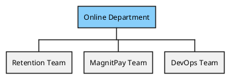
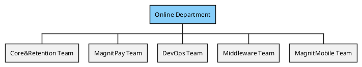
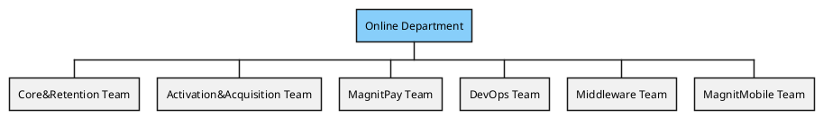
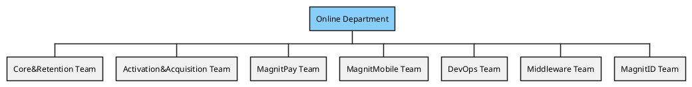
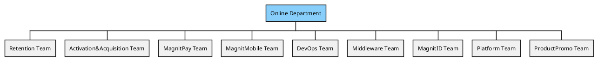
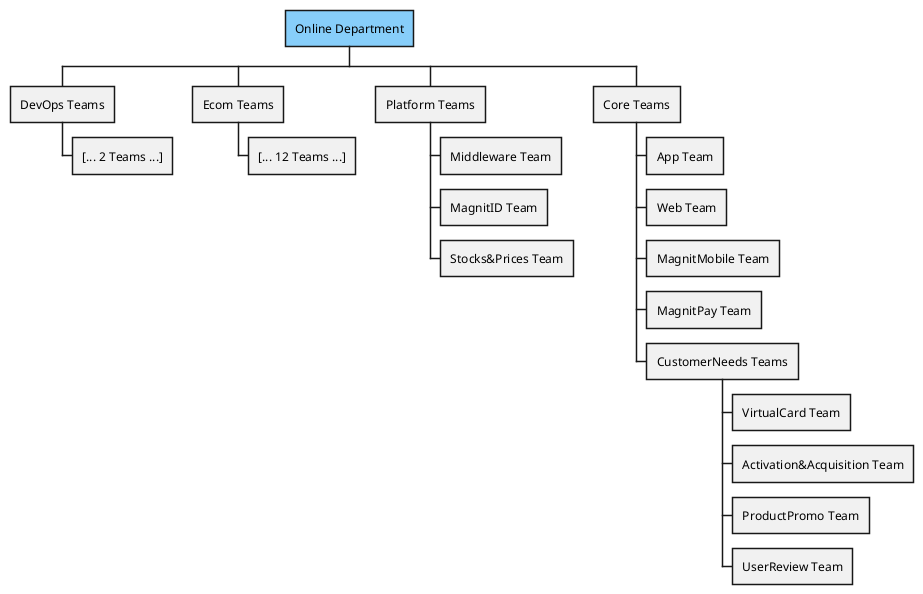

# Org Chart

## 2021

История тут

### q1

```plantuml
@startuml

@startwbs
*[#lightskyblue] Online Department
** Retention Team
** MagnitPay Team
** DevOps Team
@endwbs
@enduml
```

### q2

```plantuml
@startuml

@startwbs
*[#lightskyblue] Online Department
** Core&Retention Team
** MagnitPay Team
** DevOps Team
** Middleware Team
** MagnitMobile Team
@endwbs
@enduml
```

### q3

```plantuml
@startuml

@startwbs
*[#lightskyblue] Online Department
** Core&Retention Team
** Activation&Acquisition Team
** MagnitPay Team
** DevOps Team
** Middleware Team
** MagnitMobile Team
@endwbs
@enduml
```

### q4

```plantuml
@startuml

@startwbs
*[#lightskyblue] Online Department
** Core&Retention Team
** Activation&Acquisition Team
** MagnitPay Team
** MagnitMobile Team
** DevOps Team
** Middleware Team
** MagnitID Team
@endwbs
@enduml
```

## 2022

Планы тут

### q1

```plantuml
@startuml

@startwbs

*[#lightskyblue] Online Department
** Retention Team
** Activation&Acquisition Team
** MagnitPay Team
** MagnitMobile Team
** DevOps Team
** Middleware Team
** MagnitID Team
** Platform Team
** ProductPromo Team

@endwbs
@enduml
```

### q2

```plantuml
@startuml

@startwbs
*[#lightskyblue] Online Department

** DevOps Teams
*** [... 2 Teams ...]

** Ecom Teams
*** [... 12 Teams ...]

** Platform Teams
*** Middleware Team
*** MagnitID Team
*** Stocks&Prices Team

** Core Teams
*** App Team
*** Web Team
*** MagnitMobile Team
*** MagnitPay Team

*** CustomerNeeds Teams
**** VirtualCard Team
**** Activation&Acquisition Team
**** ProductPromo Team
**** UserReview Team

@endwbs
@enduml
```

