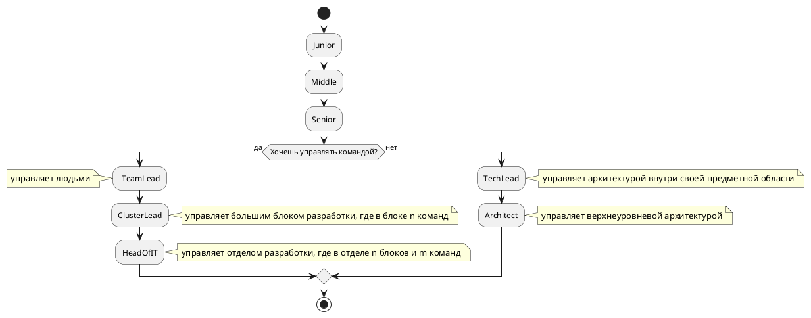

# Grades

Изначально есть [гигиенический минимум](minimum.md) которому должен соответствовать кандидат.

* [Junior](junior.md)
    * [iOS](ios/junior.md)
    * [Android](android/junior.md)
    * [Golang](golang/junior.md)
    * [Python](python/junior.md)
* [Middle](middle.md)
    * [iOS](ios/middle.md)
    * [Android](android/middle.md)
    * [Golang](golang/middle.md)
    * [Python](python/middle.md)
* [Senior](senior.md)
    * [iOS](ios/senior.md)
    * [Android](android/senior.md)
    * [Golang](golang/senior.md)
    * [Python](python/senior.md)
* [TechLead](techlead.md)
    * [iOS](ios/techlead.md)
    * [Android](android/techlead.md)
    * [Golang](golang/techlead.md)
    * [Python](python/techlead.md)
* [TeamLead](teamlead.md)
* [ClusterLead](clusterlead.md)

## Алгоритм роста грейдов

