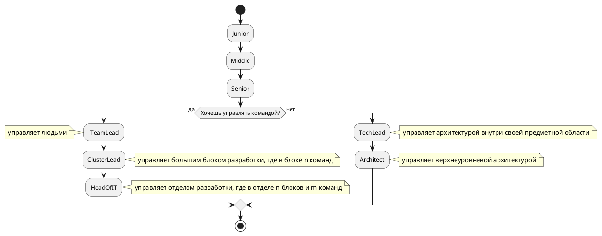

# Grades

Изначально есть [гигиенический минимум](minimum.md) которому должен соответствовать кандидат.

## Android

* [junior](android/junior.md)
* [middle](android/middle.md)
* [senior](android/senior.md)
* [TechLead](android/techlead.md)

## iOS

* [junior](ios/junior.md)
* [middle](ios/middle.md)
* [senior](ios/senior.md)
* [TechLead](ios/techlead.md)

## Backend

* [junior](backend/junior.md)
* [middle](backend/middle.md)
* [senior](backend/senior.md)
* [TechLead](backend/techlead.md)

## TeamLead

* [TeamLead](teamlead.md)

## ClusterLead

* [ClusterLead](clusterlead.md)

## Алгоритм роста грейдов

