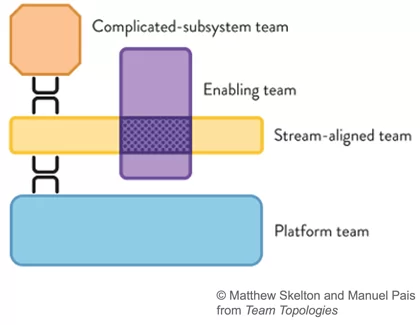

# Org Chart

## История формирования команд

### 2021

Развернуть/свернуть
Ø

#### q1

#### q2

#### q3

#### q4

### 2022

Развернуть/свернуть

#### q1

#### q2

#### q3

#### q4

## Виды команд и почему они у нас такие

Источники

* книга [TeamTopologies](https://teamtopologies.com/)
* конференция [TechLead](https://www.youtube.com/watch?v=dtSzAjt5YQc)
* конференция [DevopsConf](https://devopsconf.io/moscow/2021/abstracts/7531)
* статья [Организация Agile команд и ARTs: Командная топология в масштабе](https://agilelab.org/blog/organizing-agile-teams-and-arts-team-topologies-at-scale)
* статья [Платформенные команды — что это такое и зачем они нужны](https://apolomodov.medium.com/%D0%BF%D0%BB%D0%B0%D1%82%D1%84%D0%BE%D1%80%D0%BC%D0%B5%D0%BD%D0%BD%D1%8B%D0%B5-%D0%BA%D0%BE%D0%BC%D0%B0%D0%BD%D0%B4%D1%8B-%D1%87%D1%82%D0%BE-%D1%8D%D1%82%D0%BE-%D1%82%D0%B0%D0%BA%D0%BE%D0%B5-%D0%B8-%D0%B7%D0%B0%D1%87%D0%B5%D0%BC-%D0%BE%D0%BD%D0%B8-%D0%BD%D1%83%D0%B6%D0%BD%D1%8B-d4c978115152)

### Stream-aligned Teams

Развернуть/свернуть

Поточно-ориентированная (далее продуктовая) команда, организована вокруг потока работ и имеет возможность предоставлять ценность непосредственно клиенту или конечному пользователю.

#### Характеристики

* Работает на единый поток создания ценности, новые фичи должны составлять большую часть работы, выполняемой командой.
* Наделена полномочиями создавать и поставлять ценность для клиентов или пользователей как можно быстрее.
* Обладает всеми навыки, необходимыми для создания и поддержки любых функций и компонентов, в которых она нуждаются.
* Применяет практики дизайн мышления для лучшего понимания персоны, представляющей сегмент клиентов, которых она обслуживает — создавая и поддерживая желаемые фичи.
* Команда берет на себя ответственность за поддержку своих элементов решений в промышленной эксплуатации. Другими словами, “они строят это; они управляют этим".
* Реагировать на потребности клиентов – реагировать на запросы новых фич, инциденты и корректировать порядок действий.

#### Источники задач

* Прямая обратная связь от клиентов.
* Результаты исследований.
* Различные продуктовые метрики.

#### Эффективновность

* Прямая обратная связь от клиентов.
* Результаты исследований.
* Продуктовые метрики (в идеальном мире у команды должна быть одна понятная продуктовая метрика, за которой команда следит).

### Platform Teams

Развернуть/свернуть

Платформенная команда, организована вокруг разработки и поддержки платформ, предоставляющих услуги другим командам.

#### Характеристики

* Ориентированность на потребность коллег — если члены платформенной команды не воспринимают свою работу как продукт, который должен облегчить жизнь коллег, то скорее всего платформенная команда ускоренно движется в сторону своего расформирования.
* Высокий уровень технических компетенций — часто сложность задачи по созданию платформы для продуктовых команд сложнее, чем продуктовые задачи, а это значит, что и требования к компетенциям выше.
* Богатый опыт — зачастую только с опытом приходит некоторая технологическая мудрость, когда ты проектируешь общие решения не слишком ограниченно, но в то же время без over engineering;

#### Источники задач

* Заказ функциональности от продуктовых команд.
* Функциональность, придуманная платформенной командой самостоятельно, но на основе проблем, которые испытывают продуктовые команды.
* Технический долг, который не может решить продуктовая команда.

#### Эффективновность

* Зачастую работа платформенной команды приводит к сокращению time-to-market продуктовых команд, так как они часть функциональности могут собрать из готовых блоков или воспользоваться коробочным процессом.
* Стоимость владения решениями, построенными на общих компонентах зачастую ниже в расчете на одну команду, так как стоимость изменений общих компонент размазывается на все продуктовые команды.
* Одним из главных факторов успеха для платформенной команды является признание продуктовых команд, а выглядит это как свободный выбор продуктовых команд технических продуктов платформенной команды в условиях возможной конкуренции с open source решениями. Таким образом эти технические продукты должны облегчать работу продуктовых команд и помогать в ускорении поставок новой функциональности. Соответственно, главным провалом является вотум недоверия продуктовых команд тем продуктам и подходам, что платформенная команда продвигает в массы.

### Enabling Teams

Развернуть/свернуть

"Разблокирующая" команда организована для оказания помощи другим командам в специализированных возможностях и помощи в освоении новых технологий.

#### Характеристики

Инструменты и методы разработки решений постоянно меняются, предоставляя организациям регулярные возможности для интеграции новых практик и технологий. Хотя это приносит много преимуществ, это также создает проблемы для развития необходимых навыков и опыта во всех командах. Разблокирующие команды являются важной конструкцией. Они могут оказывать поддержку и давать рекомендации другим командам, помогая им приобретать эти новые навыки и быстро осваивать эти новые технологии.

Примеры разблокирующих команд могут предоставить экспертные знания и поддержку в следующих областях:

* Реализация DevOps.
* Автоматизированное тестирование.
* Непрерывная интеграция и инструменты для сборки.
* Методы обеспечения качества проектирования.
* Безопасность.
* Среды и конфигурация.

#### Источники задач

* Заказ функциональности от любых других команд.
* Различные области непосредственно несвязанные с разработкой и/или тестированием.

#### Эффективновность

В общем виде измерить эффективность разблокирующих команд крайне сложно. Если это DevOps - можно мерить скорость cicd и как он влияет на time-to-market, если это автоматизированное тестирование - можно мерить уменьшение времени на проведение регресса после внедрения автотестов и т.д. и т.п.

