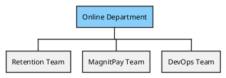
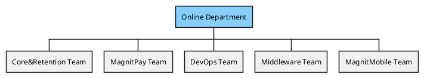
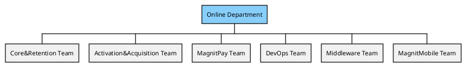
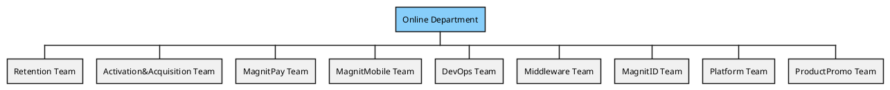
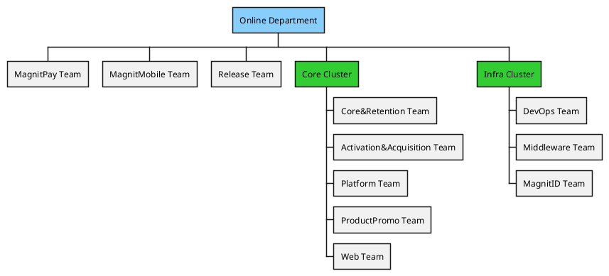
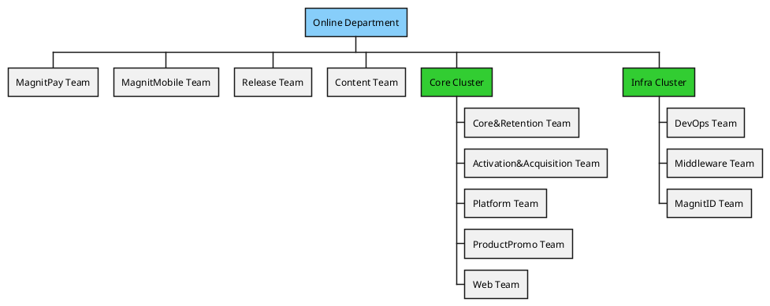
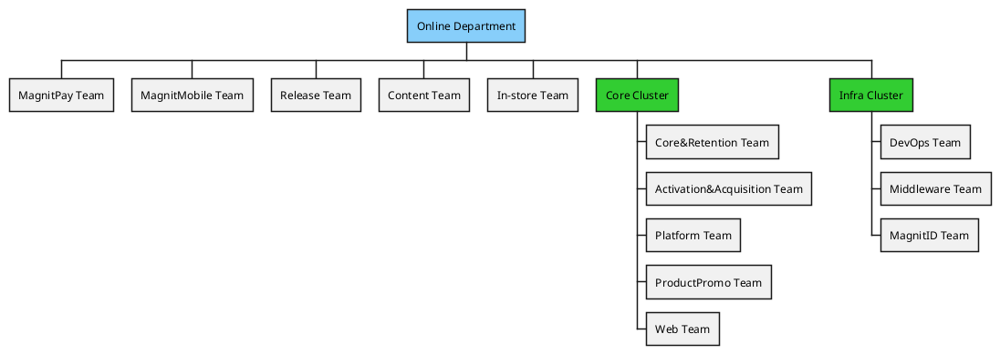

# Playbook

## О чем раздел

Данный раздел должен отвечать на следующий ряд вопросов, которые могут возникнуть как у кандидата при найме так и текущему сотрудника:

* Какая у нас структура отдела?
* Какие есть команды или другие единицы орг. структуры отдела?
* Какие в отделе грейды у IT специалистов?
* Какие обязаности у инженера внутри своего грейда?
* Как повысить свой грейд?

Очень много информации было взято (скопировано) отсюда

* [avito: playbook](https://github.com/avito-tech/playbook)
* [bestdoctor: grades](https://github.com/best-doctor/grades)

## Структура отдела

### В Общем виде

### 2021

История тут

#### q1

#### q2

#### q3

#### q4

### 2022

Планы тут

#### q1

#### q2

#### q3

#### q4

## Наши Грейды

Изначально есть [гигиенический минимум](grades/minimum.md) которому должен соответствовать кандидат.

* [Junior](grades/junior.md)
    * [iOS](grades/ios/junior.md)
    * [Android](grades/android/junior.md)
    * [Golang](grades/golang/junior.md)
    * [Python](grades/python/junior.md)
* [Middle](grades/middle.md)
    * [iOS](grades/ios/middle.md)
    * [Android](grades/android/middle.md)
    * [Golang](grades/golang/middle.md)
    * [Python](grades/python/middle.md)
* [Senior](grades/senior.md)
    * [iOS](grades/ios/senior.md)
    * [Android](grades/android/senior.md)
    * [Golang](grades/golang/senior.md)
    * [Python](grades/python/senior.md)
* [TechLead](grades/techlead.md)
    * [iOS](grades/ios/techlead.md)
    * [Android](grades/android/techlead.md)
    * [Golang](grades/golang/techlead.md)
    * [Python](grades/python/techlead.md)
* [TeamLead](grades/teamlead.md)
* [ClusterLead](grades/clusterlead.md)

## Алгоритм роста грейдов

